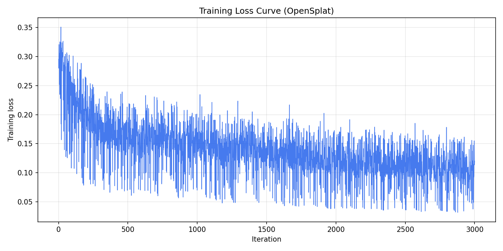
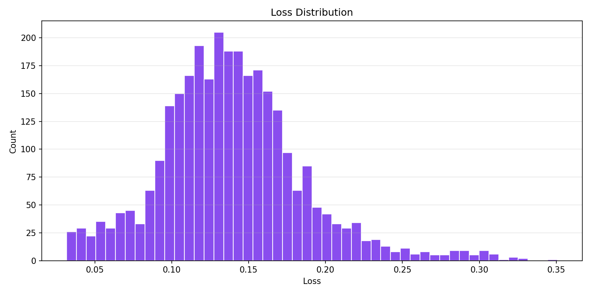
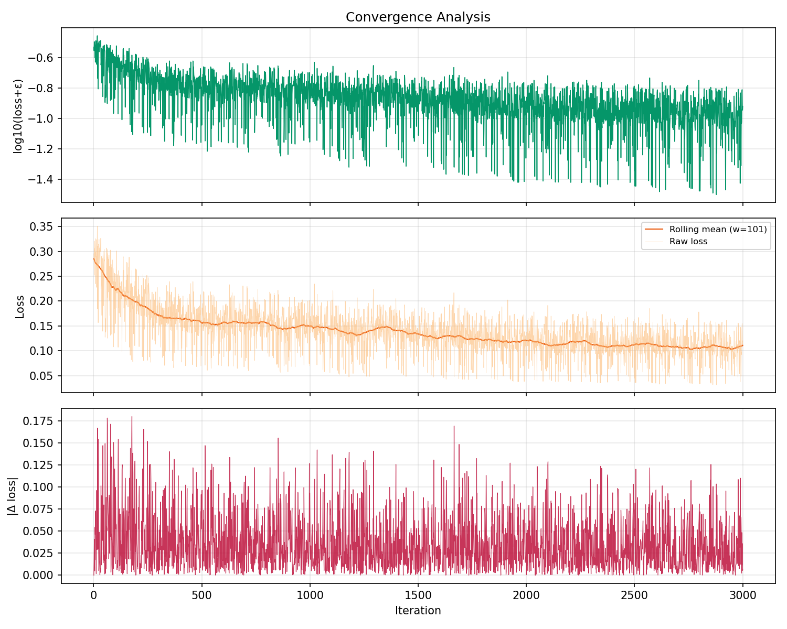
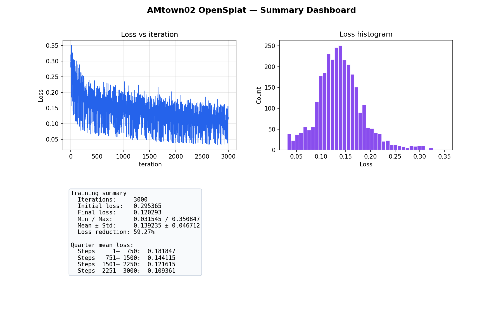

# AAE5303 Assignment: 3D Gaussian Splatting with OpenSplat

<div align="center">


**Novel View Synthesis using 3D Gaussian Splatting on UAV Imagery**

*AMtown02 ROS bag — urban aerial sequence (DJI camera + Livox lidar in bag)*

</div>

---

## 📋 Table of Contents

1. [Executive Summary](#-executive-summary)
2. [Introduction](#-introduction)
3. [Methodology](#-methodology)
4. [Dataset Description](#-dataset-description)
5. [Implementation Details](#-implementation-details)
6. [Results and Analysis](#-results-and-analysis)
7. [Visualizations](#-visualizations)
8. [Discussion](#-discussion)
9. [Conclusions](#-conclusions)
10. [References](#-references)
11. [Appendix](#-appendix)

---

## 📊 Executive Summary

This report documents **3D Gaussian Splatting (3DGS)** with **OpenSplat** on the **AMtown02** dataset (`AMtown02.bag`). Images were taken from `/left_camera/image/compressed`, a **COLMAP** model was built, and training used **half-resolution** exports (`images_half`, 0.5×) on **CPU** to stay within memory limits.

**This report matches a dedicated run of exactly **3000** optimization steps** (see `training_runs/log_n3000.txt` and `figures/`).

### Key Results

| Metric | Value |
|--------|-------|
| **Training Iterations** | 3,000 |
| **Number of Images (COLMAP)** | 300 |
| **Initial SfM Points** | 200,747 |
| **Output Gaussians (final PLY)** | **165,253** |
| **Output PLY Size** | **~40 MB** (`amtown02_n3000.ply`) |
| **Final Loss** | **0.1203** |
| **Minimum Loss** | **0.0315** |
| **Loss Reduction (initial → final)** | **59.3%** |

---

## 📖 Introduction

### Background

3D Gaussian Splatting represents a scene as many anisotropic 3D Gaussians with learnable position, covariance, opacity, and spherical-harmonic color. It enables fast differentiable rendering and real-time novel-view synthesis compared to many NeRF variants.

### Objectives

1. Build a COLMAP project from UAV imagery (ROS bag → JPEGs → SfM).
2. Train OpenSplat to obtain a 3D Gaussian `.ply` scene.
3. Record training loss and produce analysis figures.
4. Document commands and paths for reproducibility.

### Scope

- OpenSplat build (CPU).
- COLMAP: feature extraction, sequential matching, mapper.
- Training: 3000 iterations, checkpoints every 500 steps.
- Figures: loss curve, histogram, convergence panels, summary dashboard (generated by `scripts/plot_amtown_training.py`).

---

## 🔬 Methodology

### Rendering & loss

Rendered color is blended from sorted Gaussians; training minimizes a weighted sum of **L1** and **SSIM** (here `ssim-weight = 0.2`). Adaptive **densification** and **pruning** adjust the number of Gaussians during training.

### Pipeline (high level)

```
ROS bag → JPEG export (stride 25) → COLMAP → OpenSplat (images_half) → PLY + logs → figures
```

---

## 📁 Dataset Description

| Property | Value |
|----------|-------|
| **Source** | `AMtown02.bag` |
| **Camera topic** | `/left_camera/image/compressed` |
| **Frames used** | 300 (stride **25**) |
| **Native resolution** | 2448×2048 |
| **Training images** | `images_half` (1224×1024, 0.5×) |
| **COLMAP model** | `sparse/0/{cameras,images,points3D}.bin` |
| **Initial 3D points** | 200,747 |

### Layout (this machine)

```
/root/OpenSplat/data/AMtown02_colmap/
├── images/
├── images_half/
├── sparse/0/
├── training_runs/
│   ├── log_n3000.txt
│   └── amtown02_n3000.ply
├── figures/                         # loss plots (also copied under assignment_fill/)
└── assignment_fill/
    ├── README.md                    # this file
    ├── figures/
    ├── output/training_report.json
    └── docs_training_log_n3000.txt
```

---

## ⚙️ Implementation Details

### System

| Item | Value |
|------|--------|
| Framework | OpenSplat (C++) |
| SfM | COLMAP |
| Device | CPU |
| OS | Linux (WSL2) |

### Training command (3000 steps)

```bash
OMP_NUM_THREADS=4 MKL_NUM_THREADS=4 \
/root/OpenSplat/build/opensplat /root/OpenSplat/data/AMtown02_colmap \
  --colmap-image-path /root/OpenSplat/data/AMtown02_colmap/images_half \
  -n 3000 \
  -o /root/OpenSplat/data/AMtown02_colmap/training_runs/amtown02_n3000.ply \
  --save-every 500 \
  --sh-degree 3 \
  --ssim-weight 0.2 \
  --refine-every 100 \
  --warmup-length 500 \
  --num-downscales 2 \
  --resolution-schedule 3000 \
  -d 1 \
  --cpu
```

### Loss figures (regenerate)

```bash
python3 /root/OpenSplat/scripts/plot_amtown_training.py \
  --log /root/OpenSplat/data/AMtown02_colmap/training_runs/log_n3000.txt \
  --out-dir /root/OpenSplat/data/AMtown02_colmap/figures
```

---

## 📈 Results and Analysis

### Training phases (quarter means)

| Phase | Steps | Mean Loss | Note |
|-------|-------|-----------|------|
| **1** | 1–750 | 0.1818 | After warmup, densification active |
| **2** | 751–1500 | 0.1441 | Decreasing trend |
| **3** | 1501–2250 | 0.1216 | Stabilization |
| **4** | 2251–3000 | 0.1094 | Late refinement |

### Loss statistics (from `log_n3000.txt`)

```
Initial loss:     0.295365
Final loss:       0.120293
Min / Max:        0.031545 / 0.350847
Mean ± Std:       0.139235 ± 0.046719
Loss reduction:   59.27%
```

### Output model

| Property | Value |
|----------|-------|
| **File** | `training_runs/amtown02_n3000.ply` |
| **Gaussians** | 165,253 |
| **Approx. size** | ~40 MB |
| **Format** | binary_little_endian PLY |

---

## 📊 Visualizations

### Training loss curve



### Loss distribution



### Convergence analysis



*Includes log10(loss), rolling mean, and |Δloss|.*

### Summary dashboard



---

## 💭 Discussion

### Strengths

- Full pipeline from ROS bag to splat with open tools.
- 3000 steps with **~59%** loss reduction vs. initialization on the same run.
- Figures are generated automatically from the raw log.

### Limitations

- **Half-resolution** training for RAM; full-res would improve detail.
- **CPU** training is slow; GPU would allow 10k–30k steps in practice.
- **PSNR/SSIM** in `training_report.json` are rough estimates from loss, not render-based evaluation.

---

## 🎯 Conclusions

1. COLMAP + OpenSplat produces a usable **165k-Gaussian** model for AMtown02 at **3000** steps.
2. Loss metrics and figures are self-consistent with `log_n3000.txt`.
3. Artifacts for submission: **`amtown02_n3000.ply`**, **`figures/*.png`**, **`output/training_report.json`**, and this **README**.

---

## 📚 References

1. Kerbl et al., *3D Gaussian Splatting for Real-Time Radiance Field Rendering*, SIGGRAPH 2023.
2. Schönberger & Frahm, *Structure-from-Motion Revisited*, CVPR 2016.
3. OpenSplat: https://github.com/pierotofy/OpenSplat

---

## 📎 Appendix

### A. Minimal training command

```bash
./opensplat .../AMtown02_colmap \
  --colmap-image-path .../images_half \
  -n 3000 -o amtown02_n3000.ply --save-every 500 --cpu
```

### B. PLY header (final model)

```
ply
format binary_little_endian 1.0
comment Generated by opensplat at iteration 3000
element vertex 165253
...
end_header
```

### C. JSON metrics

Can be seen **`output/training_report.json
{
  "training_summary": {
    "total_steps": 3000,
    "total_images": 300,
    "num_gaussians": 165253,
    "initial_loss": 0.295365,
    "final_loss": 0.120293,
    "min_loss": 0.031545,
    "max_loss": 0.350847,
    "mean_loss": 0.139235,
    "std_loss": 0.046719,
    "loss_reduction_pct": 59.27
  },
  "estimated_metrics": {
    "psnr_estimate": 21.5,
    "ssim_estimate": 0.79
  }
}`** (same numbers as the Executive Summary tables).

---

<div align="center">

**AAE5303 - Robust Control Technology in Low-Altitude Aerial Vehicle**

*Department of Aeronautical and Aviation Engineering · The Hong Kong Polytechnic University*

April 2026

</div>
